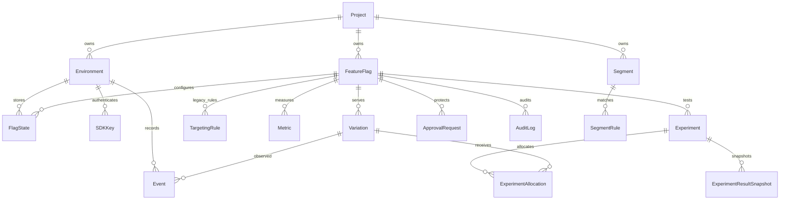
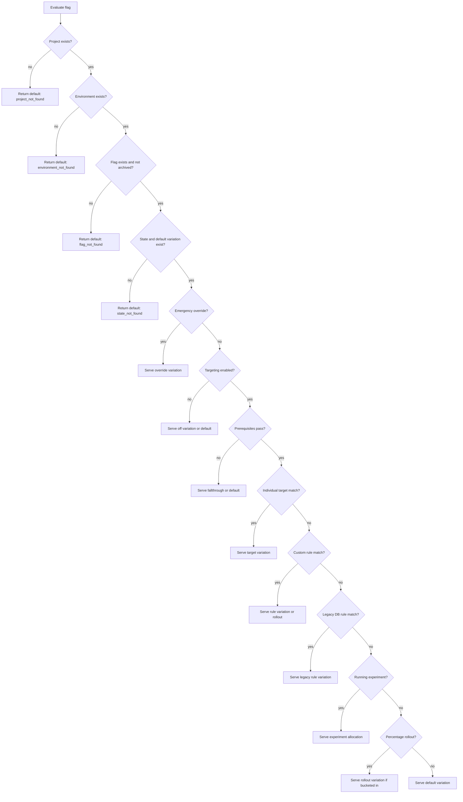
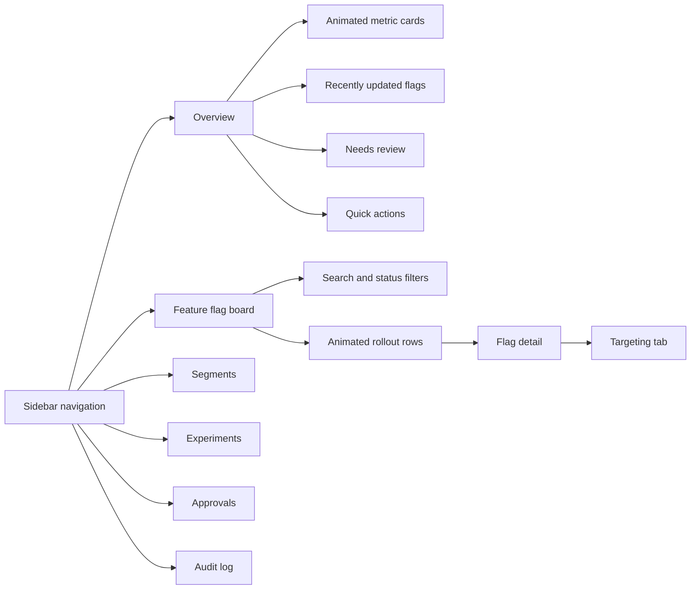
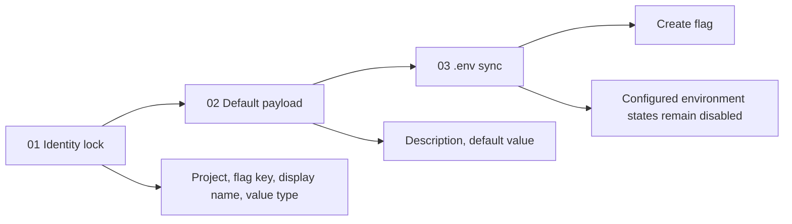
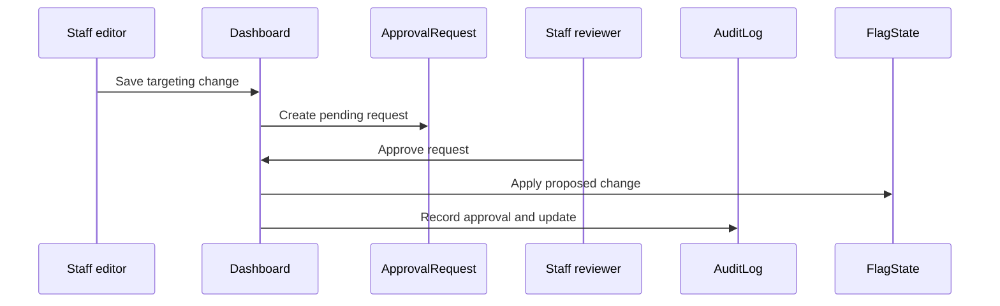

# django-featureflags

Embedded Django feature flag platform with local evaluation, remote SDK evaluation, a staff dashboard, targeting rules, segments, experiments, event tracking, approval workflows, audit logs, and management commands.

The package is designed for teams that want feature flag control inside their existing Django project without introducing a separate hosted control plane.

## Highlights

- Server-rendered staff dashboard under `/flags/`
- Feature flags scoped by project and environment
- Boolean, string, number, and JSON flag values
- Default variations and per-environment flag states
- Targeting on/off state, off variation, prerequisites, individual targets, segment clauses, custom rules, fallthrough rules, and rollout serving
- Local Python evaluation helpers for application code
- Remote evaluation API with bearer SDK key authentication
- Evaluation, impression, conversion, and custom event storage
- Experiment models with allocations, holdouts, metrics, guardrails, and result snapshots
- Approval requests for protected environments
- Audit logs for dashboard and approval activity
- Management commands for bootstrap, key rotation, import/export, event cleanup, and experiment snapshots
- Modern dashboard UI with animated metric visuals, guided Add Flag form, clickable step controls, active field states, and responsive layout

## System Map

```mermaid
flowchart LR
  App[Django application] --> LocalAPI[Local Python helpers]
  SDK[Remote service or SDK] --> HTTPAPI[POST /flags/api/evaluate/]
  Staff[Staff user] --> Dashboard[/flags/ dashboard]

  LocalAPI --> Evaluator[Evaluation engine]
  HTTPAPI --> Auth[SDK key auth]
  Auth --> Evaluator
  Dashboard --> Models[(Django database)]
  Evaluator --> Models
  Evaluator --> Events[Event service]
  Events --> Models

  Dashboard --> Approvals[Approval requests]
  Dashboard --> Audit[Audit logs]
  Approvals --> Audit
```

## Data Model



## Evaluation Flow



## Installation

```bash
pip install django-featureflags
```

Add the app to `INSTALLED_APPS`:

```python
INSTALLED_APPS = [
    # ...
    "django_feature_flags",
]
```

Mount the package URLs:

```python
from django.urls import include, path

urlpatterns = [
    # ...
    path("flags/", include("django_feature_flags.urls")),
]
```

Run migrations:

```bash
python manage.py migrate
```

Bootstrap a project, configured environments, and SDK keys:

```bash
python manage.py featureflags bootstrap --project ecommerce --name Ecommerce
```

The bootstrap command prints newly created SDK secrets once. Store them securely.

## Environment Configuration

Configured environments are read from Django settings first, then from the process environment. If neither is set, the package uses `development`, `staging`, and `production`.

```python
DJANGO_FEATURE_FLAGS_ENVIRONMENTS = ("development", "staging", "production")
```

Or with an environment variable:

```env
DJANGO_FEATURE_FLAGS_ENVIRONMENTS=development,staging,production
```

Environment keys are used by dashboard state sync, bootstrap, local evaluation, remote SDK authentication, and rollout salt.

## Dashboard

Staff users can open:

```text
/flags/
```

The dashboard is protected with Django's `staff_member_required` decorator and redirects unauthenticated users to `/accounts/login/`.

### Dashboard Routes

| Route | Purpose |
| --- | --- |
| `/flags/` | Overview dashboard |
| `/flags/flags/` | Feature flag board |
| `/flags/flags/new/` | Create flag |
| `/flags/flags/<id>/` | Flag detail and Targeting workspace |
| `/flags/flags/<id>/edit/` | Flag settings |
| `/flags/segments/` | Segment list |
| `/flags/experiments/` | Experiment list |
| `/flags/approvals/` | Approval queue |
| `/flags/audit/` | Audit log |
| `/flags/api/evaluate/` | Remote evaluation API |

### Dashboard Visualization



### UI Assets

The dashboard uses package static assets:

| Asset | Role |
| --- | --- |
| `static/django_feature_flags/dashboard.css` | Dashboard layout, visual system, animation, clickable states, responsive rules |
| `static/django_feature_flags/dashboard.js` | Metric visuals, pointer-reactive background, Add Flag step navigation, active field states, pressed controls |
| `static/django_feature_flags/targeting.js` | Targeting form row add/remove behavior and dirty state handling |

The current visual system includes layered backgrounds, metric-node visualizations, animated flag rollout rows, a guided Add Flag launch form, clickable manifest steps, active field highlighting, an animated environment signal, and reduced-motion fallbacks.

## Add Flag Workflow

The Add Flag page is a guided creation form:



What happens on save:

1. A `FeatureFlag` is created for the selected project.
2. A default `Variation` is created from the submitted default value.
3. Configured project environments are synced from `DJANGO_FEATURE_FLAGS_ENVIRONMENTS`.
4. A `FlagState` is created for each configured environment.
5. Every new state starts disabled and points at the default variation.

This keeps new flags safe by default. Creating a flag does not turn it on in any environment.

## Local Evaluation

Use local helpers when your Django application evaluates flags from the same database.

```python
from django_feature_flags import flags

enabled = flags.bool_variation(
    "new_checkout",
    {"key": "user-123", "plan": "pro"},
    default=False,
    project="ecommerce",
    environment="production",
)
```

Available helpers:

```python
flags.variation(flag_key, context, default=None, project="default", environment="production", track=False)
flags.bool_variation(flag_key, context, default=False, project="default", environment="production", track=False)
flags.string_variation(flag_key, context, default="", project="default", environment="production", track=False)
flags.number_variation(flag_key, context, default=0, project="default", environment="production", track=False)
flags.json_variation(flag_key, context, default=None, project="default", environment="production", track=False)
```

Set `track=True` to record evaluation events.

## Remote Evaluation API

Remote callers authenticate with an SDK key generated by bootstrap or key rotation.

```http
POST /flags/api/evaluate/
Authorization: Bearer <sdk_key>
Content-Type: application/json

{
  "flag_key": "new_checkout",
  "context": {"key": "user-123", "plan": "pro"},
  "default": false,
  "track": true
}
```

Response:

```json
{
  "value": true,
  "variation_key": "default",
  "reason": "fallthrough",
  "flag_key": "new_checkout",
  "environment_key": "production"
}
```

Authentication failures return:

```json
{"error": "unauthorized"}
```

Invalid JSON returns:

```json
{"error": "invalid_json"}
```

## Targeting

Open `/flags/flags/`, choose a flag, and use the Targeting tab to configure one environment at a time.

The dashboard supports:

- targeting enabled or disabled
- off variation
- prerequisites
- individual context targets
- segment rules
- custom ordered rules
- fallthrough/default behavior
- rollout serving
- event tracking controls
- preview evaluation with multi-context JSON
- approval-aware saves

### Multi-Context Example

```json
{
  "user": {"key": "user-123", "plan": "pro"},
  "device": {"key": "phone-1", "platform": "ios"},
  "organization": {"key": "org-9", "tier": "enterprise"}
}
```

### Targeting Document Shape

```json
{
  "off_variation": "off",
  "prerequisites": [
    {"flag_key": "account_migration", "variation_key": "on"}
  ],
  "targets": [
    {
      "context_kind": "user",
      "values": ["user-123", "user-456"],
      "variation_key": "on"
    }
  ],
  "rules": [
    {
      "id": "enterprise-ios",
      "description": "Enterprise users on iOS",
      "clauses": [
        {
          "context_kind": "organization",
          "attribute": "tier",
          "operator": "equals",
          "values": ["enterprise"]
        },
        {
          "context_kind": "device",
          "attribute": "platform",
          "operator": "equals",
          "values": ["ios"]
        }
      ],
      "serve": {"variation_key": "on"}
    }
  ],
  "fallthrough": {"variation_key": "off"},
  "track_events": false
}
```

Rollout serve behavior uses integer weights that total `100000`:

```json
{
  "serve": {
    "rollout": {
      "context_kind": "user",
      "salt": "production",
      "variations": [
        {"variation_key": "on", "weight": 25000},
        {"variation_key": "off", "weight": 75000}
      ]
    }
  }
}
```

## Segments

Segments are reusable audiences scoped to a project. Segment rules store JSON conditions and can be referenced by targeting clauses using the `segment_match` operator.

Use segments when the same audience definition needs to be reused across multiple flags.

## Experiments

Experiments attach to flags and can allocate traffic across variations.

Core objects:

- `Metric`: conversion, funnel, or guardrail metric definition
- `Experiment`: draft, running, paused, or stopped experiment
- `ExperimentAllocation`: variation allocation weight and holdout marker
- `ExperimentResultSnapshot`: point-in-time event and conversion counts

Create result snapshots with:

```bash
python manage.py featureflags snapshot-results
```

## Approvals and Audit Logs

Environments can require approval for targeting changes.



Audit logs store user, environment, flag, action, reason, before payload, after payload, and timestamp.

## Event Tracking

The package stores events for evaluation and experiment analysis.

Event types:

- `evaluation`
- `impression`
- `conversion`
- `custom`

Events can include context key, metric key, numeric value, and JSON payload.

Cleanup old events with:

```bash
python manage.py featureflags cleanup-events --days 90
```

## Management Commands

All commands are grouped under `featureflags`.

| Command | Purpose |
| --- | --- |
| `python manage.py featureflags bootstrap --project ecommerce --name Ecommerce` | Create project, configured environments, and SDK keys |
| `python manage.py featureflags export --project ecommerce` | Print project flag configuration as JSON |
| `python manage.py featureflags import path/to/export.json` | Import project, environments, flags, variations, and states |
| `python manage.py featureflags rotate-key --project ecommerce --environment production` | Deactivate active SDK keys and print a new secret |
| `python manage.py featureflags cleanup-events --days 90` | Delete events older than the cutoff |
| `python manage.py featureflags snapshot-results` | Create experiment result snapshots |

## Import and Export

Export:

```bash
python manage.py featureflags export --project ecommerce > flags-export.json
```

Import:

```bash
python manage.py featureflags import flags-export.json
```

Export includes project metadata, environments, flags, variations, states, rollout data, and emergency overrides. It does not export events, audit logs, approvals, experiments, metrics, SDK keys, or the `FlagState.targeting` document. Review generated JSON before importing into another environment.

## SDK Keys

SDK keys are stored as SHA-256 hashes. Raw secrets are only printed when they are created.

Rotate a key:

```bash
python manage.py featureflags rotate-key --project ecommerce --environment production
```

Use the printed secret in remote evaluation requests:

```http
Authorization: Bearer dff_<secret>
```

## Development

Install the package in editable mode with test dependencies:

```bash
python -m pip install -e ".[test]"
```

Run the test suite:

```bash
pytest -q
```

Run dashboard-focused tests:

```bash
pytest tests/test_dashboard.py -q
```

Check the dashboard JavaScript syntax:

```bash
node --check src/django_feature_flags/static/django_feature_flags/dashboard.js
```

## Package Structure

```text
src/django_feature_flags/
  api/                  Remote evaluation endpoint and bearer auth
  audit/                Audit and approval services
  dashboard/            Staff dashboard views, forms, targeting forms, URLs
  evaluation/           Evaluation engine
  events/               Event recording service
  experiments/          Experiment services
  management/commands/  featureflags management command
  migrations/           Django migrations
  models/               Core, audit, event, and experiment models
  static/               Dashboard CSS and JavaScript
  targeting/            Targeting documents, operators, rollout helpers
  templates/            Dashboard templates
```

## Security Notes

- Mount the dashboard only where Django staff authentication is appropriate.
- Treat SDK secrets like credentials. Store them in a secret manager or protected environment variables.
- Rotate SDK keys when a secret is exposed.
- Use environment approval requirements for production or other protected environments.
- Keep audit logs for operational traceability.
- Do not expose `/flags/api/evaluate/` without HTTPS in production.

## Troubleshooting

### Dashboard redirects to login

The dashboard requires a staff user. Ensure the user is authenticated and has `is_staff=True`.

### Remote API returns `unauthorized`

Check that the request includes `Authorization: Bearer <sdk_key>`, the SDK key is active, and the key belongs to the environment you expect.

### Evaluation returns the default value

Check the response reason or local `EvaluationResult`:

- `project_not_found`: project key does not exist
- `environment_not_found`: environment key does not exist for the project
- `flag_not_found`: flag key does not exist or is archived
- `state_not_found`: flag has no state/default variation for the environment
- `off`: targeting is disabled
- `invalid_targeting`: targeting document failed validation
- `prerequisite_failed`: a prerequisite did not serve the required variation

### New flag is not enabled

This is expected. New flags are created with disabled environment states so rollout is safe by default. Open the flag Targeting page and enable targeting for the environment you want.

### Configured environments are missing

Set `DJANGO_FEATURE_FLAGS_ENVIRONMENTS`, then run bootstrap or save a flag to sync environment rows:

```bash
DJANGO_FEATURE_FLAGS_ENVIRONMENTS=development,staging,production python manage.py featureflags bootstrap --project ecommerce --name Ecommerce
```

## Version

Current package version:

```text
0.1.0
```
